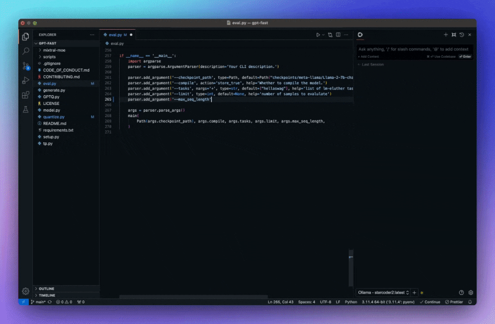

<h1 align="center">Continue</h1>

**[Continue](https://docs.continue.dev) 使开发者能够通过我们的开源 [VS Code](https://marketplace.visualstudio.com/items?itemName=Continue.continue) 和 [JetBrains](https://plugins.jetbrains.com/plugin/22707-continue-extension) 扩展以及[模型、规则、提示、文档和其他构建模块的中心](https://hub.continue.dev)创建、共享和使用自定义 AI 代码助手**

## 聊天

[聊天](https://continue.dev/docs/chat/how-to-use-it)使您可以轻松地向 LLM 寻求帮助，而无需离开 IDE

## 自动完成

[自动完成](https://continue.dev/docs/autocomplete/how-to-use-it)在您输入时提供内联代码建议

## 编辑

[编辑](https://continue.dev/docs/edit/how-to-use-it)是一种在不离开当前文件的情况下修改代码的便捷方式

## 操作

[操作](https://continue.dev/docs/actions/how-to-use-it)是常见用例的快捷方式

## 入门

在[这里](https://continue.dev/docs/getting-started/install)了解如何安装和使用 Continue

## 贡献

查看[贡献想法板](https://github.com/orgs/continuedev/projects/2)，阅读[贡献指南](https://github.com/continuedev/continue/blob/main/CONTRIBUTING.md)，并加入 Discord 上的 [#contribute](https://discord.gg/vapESyrFmJ)

## 许可证

[Apache 2.0 © 2023-2024 Continue Dev, Inc.](./LICENSE) 